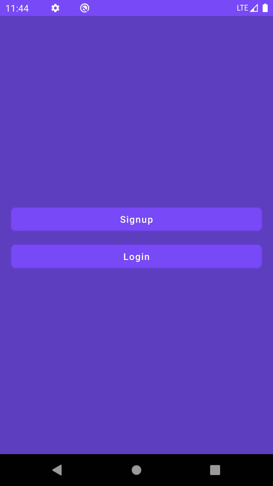
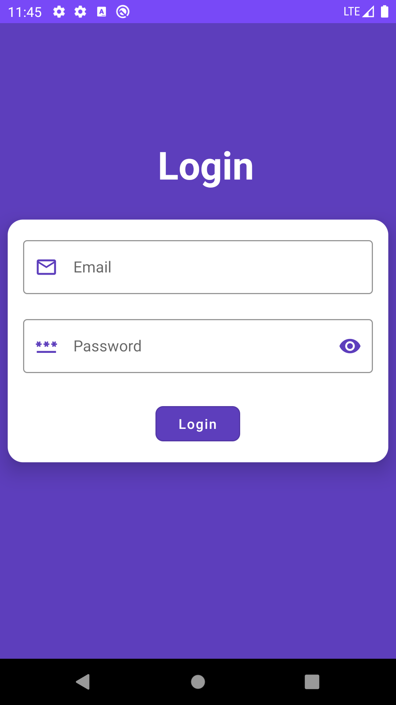
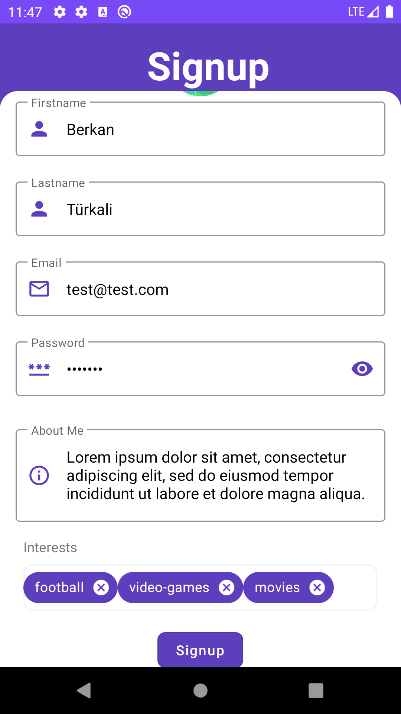
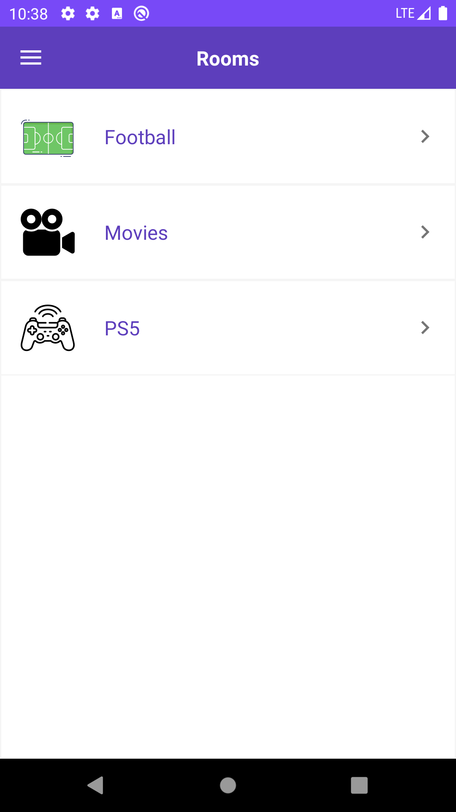
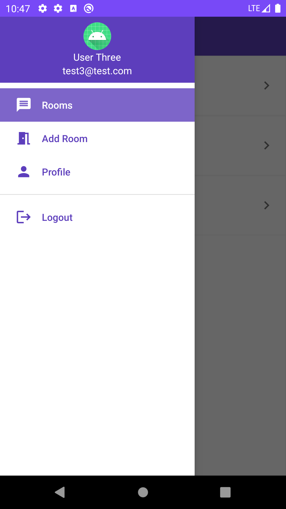
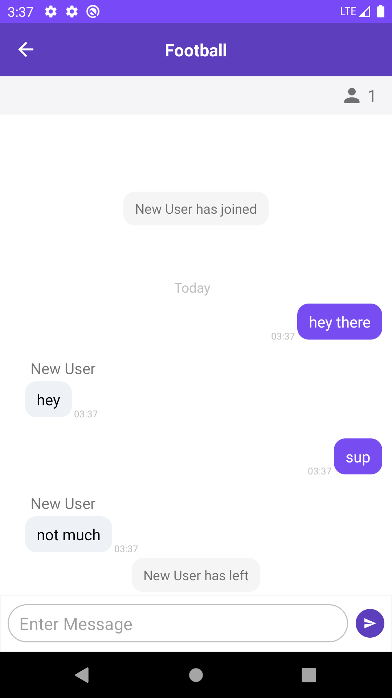
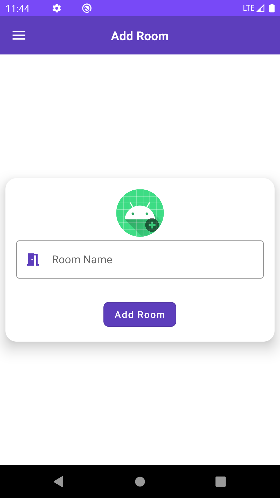
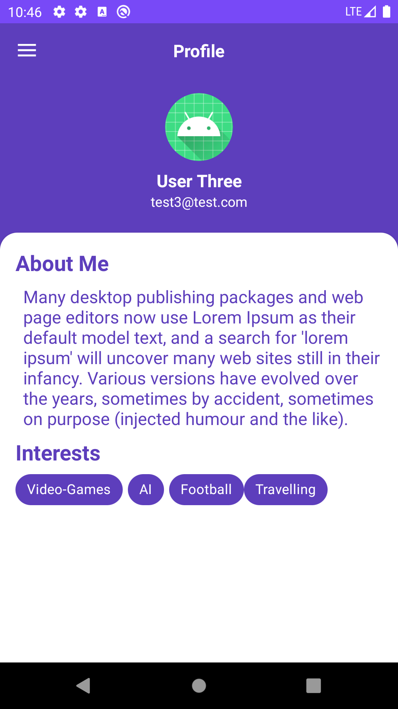

# ChatApp
## Screenshots
   
  
 

 ## About
 Simple Android Chat App that uses [Socket.io](https://socket.io/) 
  
  ## Server-Side Code
  * [Repo](https://github.com/berkanturkali/ChatApp-Server)
