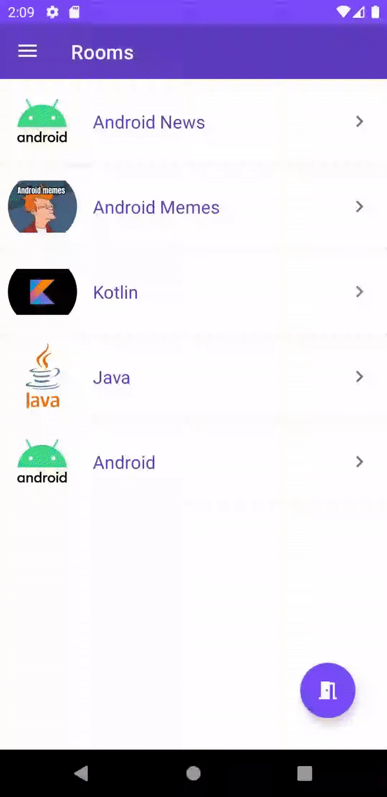

# ChatApp

|             Login & Signup Fragment         |                  Messages Fragment            |
| :-----------------------------------------: |  :------------------------------------------: |
| |   |

|             Add Room Fragment               |                  Rooms Fragment               |
| :-----------------------------------------: | :-------------------------------------------: |
|  |  |

## About
Simple Android Chat App with [Socket.io](https://socket.io/), [Express](https://expressjs.com/) and [MongoDB](https://www.mongodb.com/)

## Server-Side Code
* [Repo](https://github.com/berkanturkali/ChatApp-Server)
